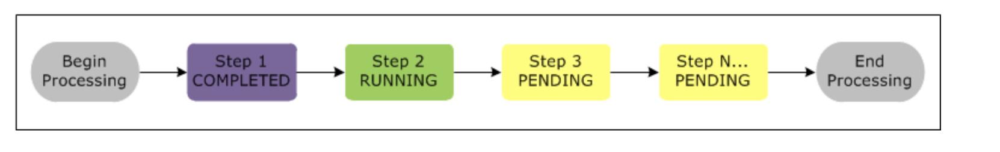
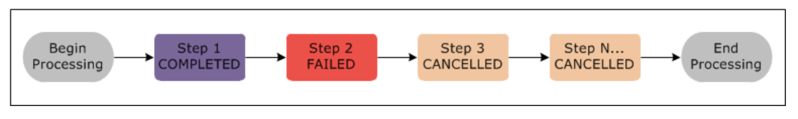

# AWS EMR
Managed cluster platform that simplifies running big data frameworks such as Hadoop, Spark, etc.

Can also be used to transform and move data in and out of AWS Data Sources such as S3 and DynamoDb.

Node Types in EMR Cluster:
- master Node: manages cluster, tracks jobs and monitors health of cluster
- Core Node: Run tasks and store data on HDFS. Multi node clusters need atleast one core node.
- Task Node: Just run tasks. It's optional.

3 ways to submit work to cluster:
1- Define job in terms of steps beforehand, launch cluster and run jobs then terminate the cluster.
2- Create a long running cluster and submit steps which can contain multiple jobs.
3- SSH to the master node and run the installed softwares directly.

Each step is a unit of work, for example:
1- Submit an input dataset for processing.
2- Process the output of the first step by using a Pig program.
3- Process a second input dataset by using a Hive program.
4- Write an output dataset.

Steps state changes:

If a step fails next steps are cancelled b y default but that behavior can changes.

Can use a default or custom AMI for EMR cluster instances.

Cluster state changes:
STARTING => BOOTSTRAPPING (Installs softwares) => RUNNING (can SSH at this point) => WAITING (After steps are done) => SHUTTING_DOWN (if auto-terminate is enabled) => COMPLETED

If there is a failure during cluster lifecycle cluster state changes to FAILED and it is terminated. (cluster data is lost) (unless termination-protection is enabled).

**EMR Benefits**
- Cost saving: Can use Spot or Reserved Instances
- Integration with EC2 (Launching nodes), VPC (Can choose custom VPC), S3, Cloudwatch (Monitor cluster and alarms), IAM, CloudTrail, Data Pipeline (Schedule and start clusters)
- Deployment: Can choose instance type based on need, select an EMR release (a group of pre-defined softwares), select an MapR districution and install softwares intially during bootstrap using yum.
- Scalibility and Flexibility: Can resize cluster based on need, can use multiple instance groups for example on-demand group and spot instancs group.
- Flexibility: In terms of file system to use HDFS (in master and core nodes) or EMRFS (on top of S3) so data is persisted outside of the lifecycle of cluster. EMRFS decouples storage from compute. (can scale your compute needs by resizing your cluster and you can scale your storage needs by using Amazon S3).
- Reliability: EMR monitors cluster and replaces failed nodes. Allows transient clusters (auto terminated after job is done). or long-running clusters that require manual termination.
- Security: EMR uses roles for the services itself and the instance profile roles. EMR uses one security group for master node and one (shared) for core and task nodes. Can add additional security groups. Can use server side or client side encryption with EMRFS. EMR supports VPC, CloudTrail and Ec2 key pairs (for SSH).
- Monitoring
- Management Interfaces

